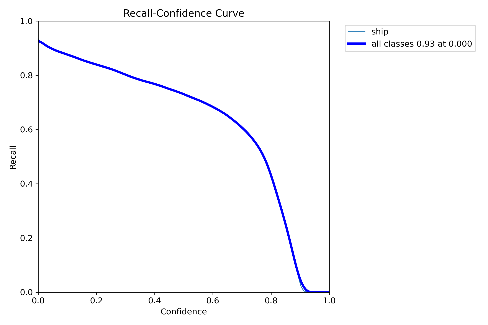

# Ship Detection in SAR (Synthetic Aperture Radar) Data

## Data Preparation:

1) Initially, I downloaded the dataset from the provided repository, HRSID. Within this repository, a link was available for downloading the dataset.

2) The dataset comprises 5604 images, and the annotations are specified in the files: train2017.json, test2017.json, and train_test.json.

3) To organize the dataset, I utilized the information from train.json. I mapped image names in the JSON file to the corresponding folders containing images. Subsequently, I moved the mapped images to the "train" folder. This process was repeated for the "test" folder, resulting in a dataset split of 65% for training and 35% for testing.

4) For each image file, I generated a corresponding text file with annotations in the YOLO-supported format. The bounding box (bbox) values were extracted from the respective train.json and test.json files. These values were then normalized by the height and width of the images, with a class information column added (prefixed with 0). Since, YOLO requires annotations in a 5-column format [class, x_min, y_min, x_max, y_max].

## Model Training:

- Used YOLOv8 Model for Ship Detection and trained on the dataset.
- Find the best model weights in the weights folder (best.pt).
- View training results in "[results.csv](runs/detect/train/results.csv)".

*Check the Code:*

- For more details on model training and evaluation, refer to the code in "[ship_detection.ipynb](ship_detection.ipynb)" or "[ship_detection.py](ship_detection.py)".

## Quantitative Results:

| Precision | Recall | mAP50 | mAP50-95 |
|-----------|--------|-------|----------|
| 0.906     | 0.777  | 0.879 | 0.626    |

## Qualitative Results:

### Results Plot:

### Confusion Matrix:

### Additional Results:

| F1_curve | P_curve |
|--------------------|----------------------|
|      |  |

| PR_curve | R_curve |
|--------------------|----------------------|
|      |        |

- More results can be found in runs/detect/train folder.
 
## Predictions:

| Original Image | Predicted Detection |
|--------------------|----------------------|
|      |        |
|                 |                   |
|  | |
|  | |
|  | |

- You can find additional predicted detection images within the "predict" folder.
## Reference Paper:

[1] Shunjun Wei ; Xiangfeng Zeng ; Qizhe Qu ; Mou Wang ; Hao Su ; Jun Shi. "[HRSID: A High-Resolution SAR Images Dataset for Ship Detection and Instance Segmentation](https://ieeexplore.ieee.org/stamp/stamp.jsp?tp=&arnumber=9127939)" . IEEE Access
